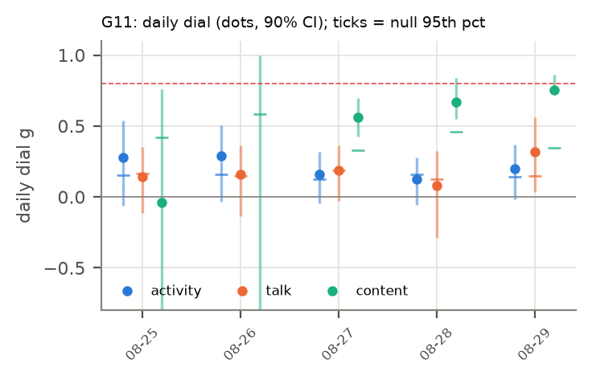

# H25 × G11: Pursue whatever you'd like to (2025-08-25 → 2025-08-29)

**Verdict:** mixed
**Verdict (1b):** mixed (round 1: mixed; corrected table, same rule)
**Role:** replication (exploratory (round 1, non-holdout))
**Period:** regime I · mode F · 7 agents at start · 5 non-holdout days · 3.0 h/day (empirical).

## Why this period
One day-resolved stretch of the dial. Every non-holdout period gets the same daily dial (activity, talk, content) so periods can be compared through their fitted values. Reference values: H19 g_eq active 0.30, talk 0.22; H03 n̂ TALK 0.61.

## Prediction
*Written 2026-10-04 02:00 UTC, before running the dial on this period.* The card's predictions (P1–P7) as they apply here; H19's per-period values were known (disclosed in the card).
- **Activity dial** (stalls masked): daily values mostly in [−0.1, 0.4]; period mean near H19's g_eq active = 0.30 (± 0.07), lowered by 0–0.05 where stalls are masked: predicted range [0.22, 0.33].
- **Talk dial** (stalls kept): period mean within ± max(0.05, 2 SE) of H19's g_eq talk = 0.22.
- **Content dial** (F2): period median in [0.15, 0.6], above the activity dial (HH108; credence 0.55), and below H01's 0.74.
- **Subcritical:** every day's upper 90% bound < 0.8 in all channels.
- Regime I/II: activity dial expected lower than in regime III; talk dial comparatively higher (H19).
- **Verdict rule** (card): *supported* if (i) all days subcritical in all estimable channels, (ii) the activity and talk dials with stalls kept reproduce H19's g_eq within max(0.05, 2 SE), and (iii) the period's median content dial (F2) is < 0.74; *failed* if any day has a lower 90% bound > 0.8 in any channel, or (ii) and (iii) both fail; *mixed* otherwise.
- *Against:* a confidently near-critical day; a period mean far from H19's estimator (implementation or stall effect larger than expected); content at or above 0.74 after field removal.

## Result
| Dial | days | fixed-effect mean ± SE | random-effects mean ± SE | median | between-day I² (Cochran p) | share of days with upper bound < 0.8 | max lower bound |
| --- | --- | --- | --- | --- | --- | --- | --- |
| activity (stalls masked) | 5 | 0.186 ± 0.056 | 0.186 ± 0.056 | 0.200 | 0.00 (p 0.898) | 1.00 | -0.02 |
| activity (stalls kept) | 5 | 0.231 ± 0.059 | 0.231 ± 0.059 | 0.277 | 0.00 (p 0.448) | 1.00 | 0.07 |
| talk (stalls masked) | 5 | 0.182 ± 0.065 | 0.182 ± 0.065 | 0.159 | 0.00 (p 0.887) | 1.00 | 0.03 |
| talk (stalls kept) | 5 | 0.192 ± 0.063 | 0.192 ± 0.063 | 0.198 | 0.00 (p 0.867) | 1.00 | 0.03 |
| content F1 | 5 | 0.737 ± 0.035 | 0.737 ± 0.035 | 0.564 | 0.00 (p 0.850) | 0.40 | 0.72 |
| content F2 (primary) | 5 | 0.718 ± 0.039 | 0.718 ± 0.039 | 0.563 | 0.00 (p 0.603) | 0.40 | 0.72 |
| content F3 | 5 | 0.718 ± 0.035 | 0.718 ± 0.035 | 0.587 | 0.00 (p 0.446) | 0.20 | 0.73 |

| Check | Observed | Outcome |
| --- | --- | --- |
| (i) every day subcritical (upper 90% bound < 0.8, all channels) | no | fail |
| (ii) stalls-kept dials vs H19 g_eq (active 0.30, talk 0.22) | activity 0.23, talk 0.19 | pass |
| (iii) content F2 median < 0.74 | 0.56 | pass |
| any day confidently near-critical (lower bound > 0.8) | no | – |

Stall minutes masked: 1.5% of the day on average. T/T_c = 1/g for the activity dial (stalls masked): 5.39; amplification 1/(1 − g) = 1.23.

  
Data: `data/processed/H25-criticality-dial/G11/dial_daily.parquet`, `results.json`.

## Scorecard (period-specific axes)
- **C (adequacy):** day-level null band (circular shifts): share of days with activity dial above its null 95th percentile = 0.80.
- **D (unfitted):** H19 agreement (ii) passes; H03 n̂ TALK 0.61 vs talk dial 0.18 (cross-period test in the card).
- **G (known structure):** see the card's event tests (regime switch, goal changes) where this period is involved.

## Round 1b (improved data, 2026-10-04)
Same pipeline (`analysis/explore.py --data-version fixed`) on DQ8's `activity_bins_fixed` and the shared `outages_fixed` stall table (round 1's activity table dropped about half of all events). Predictions and verdict rule unchanged; check (ii) now compares with H19's estimator recomputed on the fixed table (round-1 H19 values are stale). The DQ8 row trims each day to the window in which all agents are between their first and last active minute before the block-shift null is drawn (whole-day block-shift nulls reject 28–34% of independent swarms).

| Quantity | Round 1 (old table) | Round 1b (fixed table) |
| --- | --- | --- |
| activity dial, stalls masked (fixed-effect mean; median) | 0.19; 0.20 | 0.20; 0.19 |
| activity dial, stalls kept vs H19 g_eq | 0.23 vs 0.30 | 0.26 vs 0.33 (H19 estimator on the fixed table) |
| talk dial, stalls masked (fixed-effect; random-effects) | 0.18; 0.18 | 0.15; 0.15 |
| talk dial, stalls kept vs H19 g_eq talk | 0.19 vs 0.22 | 0.16 vs 0.19 |
| days above the block-shift null q95: activity (round-1 design → **DQ8 trim**) | 4/5 | 4/5 → 2/5 |
| median activity dial with the DQ8 trim | – | 0.14 |
| content dial F2 median (inputs unchanged) | 0.56 | 0.56 |
| per-period verdict (card rule) | mixed | mixed |

Data: `data/processed/H25-criticality-dial/r1b/G11/`.

## Notes
- 2026-10-04 02:14 UTC: results filled by `analysis/write_period_folders.py --results` from `analysis/explore.py` (exploratory round 1). Prediction block above unchanged from the --predict pass.
- Reading notes (card, Results): the content dial's upper bounds are wide, so check (i) fails in every period; fixed-effect means are pulled toward days with 3–4 talkers, whose bootstrap SEs are small (compare the random-effects mean); per-pair correlation, not g, is the size-free quantity (card, post hoc PH1).
