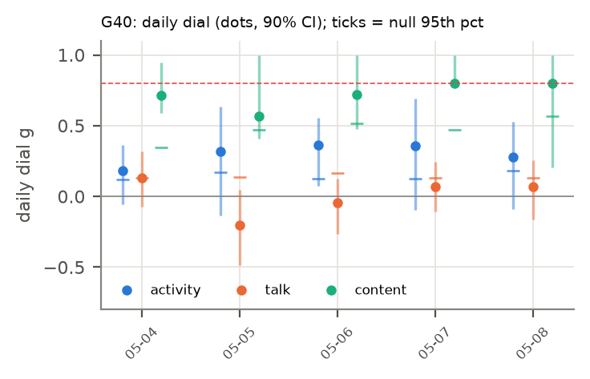

# H25 × G40: Connect your worlds into a 3D universe! (2026-05-04 → 2026-05-08)

**Verdict:** mixed
**Verdict (1b):** mixed (replication, round 1: mixed; corrected table, same rule) · native NE42 test: mixed
**Role:** native (round 1b: NE42 room merge at a fixed roster; round-1 role: exploratory replication)
**Period:** regime III · mode C · 15 agents at start · 5 non-holdout days · 4.1 h/day (empirical).

## Why this period
One day-resolved stretch of the dial. Every non-holdout period gets the same daily dial (activity, talk, content) so periods can be compared through their fitted values. Reference values: H19 g_eq active 0.35, talk 0.02; H03 n̂ TALK 0.00.

## Prediction
*Written 2026-10-04 02:00 UTC, before running the dial on this period.* The card's predictions (P1–P7) as they apply here; H19's per-period values were known (disclosed in the card).
- **Activity dial** (stalls masked): daily values mostly in [−0.1, 0.4]; period mean near H19's g_eq active = 0.35 (± 0.04), lowered by 0–0.05 where stalls are masked: predicted range [0.27, 0.38].
- **Talk dial** (stalls kept): period mean within ± max(0.05, 2 SE) of H19's g_eq talk = 0.02.
- **Content dial** (F2): period median in [0.15, 0.6], above the activity dial (HH108; credence 0.55), and below H01's 0.74.
- **Subcritical:** every day's upper 90% bound < 0.8 in all channels.
- Regime III: activity dial expected higher than in regime I (H19's +0.11), talk dial lower.
- **Verdict rule** (card): *supported* if (i) all days subcritical in all estimable channels, (ii) the activity and talk dials with stalls kept reproduce H19's g_eq within max(0.05, 2 SE), and (iii) the period's median content dial (F2) is < 0.74; *failed* if any day has a lower 90% bound > 0.8 in any channel, or (ii) and (iii) both fail; *mixed* otherwise.
- *Against:* a confidently near-critical day; a period mean far from H19's estimator (implementation or stall effect larger than expected); content at or above 0.74 after field removal.
- The merged-rooms week (NE42: #best and #rest merged 05-04, split again 05-11).

## Round 1b native test: NE42 room merge and split at a fixed roster (#39 → #40 → #41)
*Prediction written 2026-10-04 06:34 UTC, before computing any round-1b dial for #39–#41. Seen before: the round-1 period means of #39–#41 on the old table (card table); H26's finding that content co-moves within rooms and activity village-wide.*

**Why:** the 15 agents sit in two rooms in #39 and #41 and in one room in #40 (NE42 A-B-A). The two size readings of the dial make opposite predictions for a room merge at fixed N. If the talk channel is mean-field with a per-message budget (J₀ divided by the number of room-mates, PH1's talk reading), whole-swarm VR − 1 ≈ c in both layouts, so the talk dial does not move. If per-pair correlation is a constant inside a room (a shared room field, PH1's content reading), merging two rooms of n = N/2 into one roughly doubles VR − 1. Activity co-moves village-wide (H26), so rooms should not matter for it.

**Design:** period random-effects means of the daily dials on `activity_bins_fixed` (`auto` mask; content F2 unchanged inputs), with Δ = #40 − mean(#39, #41) and its SE from the period SEs.
- **N2a (talk is size-free).** |Δ_talk| < 0.05 or its 90% interval includes 0.
- **N2b (content is a room field).** Content VR − 1 in #40 ≥ 1.5 × the mean of #39 and #41.
- **N2c (activity is village-wide).** |Δ_activity| < 0.05 or its 90% interval includes 0.
- Credence: N2a 0.55, N2b 0.4, N2c 0.6. Confound: the goal changes at both boundaries (#40 is a shared-artifact week).
- **Verdict rule (native):** supported if N2a–N2c hold; failed if none holds; mixed otherwise.

**Round 1b native result (run 2026-10-04 06:42 UTC, `analysis/r1b_native.py`).** Period random-effects means of the daily dials on the fixed table (5 days each).

| Dial | #39 (two rooms) | #40 (one room) | #41 (two rooms) | Δ = #40 − mean(#39, #41) [90% CI] | VR − 1 ratio #40 / mean(#39, #41) |
| --- | --- | --- | --- | --- | --- |
| activity | 0.217 ± 0.091 | 0.385 ± 0.099 | 0.211 ± 0.083 | +0.171 [−0.021, +0.362] | 2.3 |
| talk | 0.134 ± 0.051 | 0.003 ± 0.064 | 0.177 ± 0.050 | **−0.152 [−0.273, −0.031]** | 0.02 |
| content F2 | 0.61 (one degenerate day) | 0.75 ± 0.05 | 0.79 ± 0.03 | +0.05 (uninformative) | 1.1 |

| Prediction | Observed | Verdict |
| --- | --- | --- |
| N2a talk is size-free (Δ within ±0.05 or CI includes 0) | −0.15, CI excludes 0: talk co-activation vanishes in the merged room | ✗ |
| N2b content VR − 1 rises ≥ 1.5× (room field) | 1.1× | ✗ |
| N2c activity unchanged (CI includes 0) | +0.17, CI includes 0 (but large) | ✓ |

**Native verdict: mixed.** Neither size reading predicted the talk result: with all 14 agents in one room, talk co-activation drops to zero (g 0.003) and returns at the split. Per-pair talk coupling fell faster than the per-message budget (J₀/N) allows, as if a room of 14 breaks the fast reply bursts that make talk co-activate (or the shared-artifact week moved talk into the artifact). Goal changes at both boundaries confound it.

## Result
| Dial | days | fixed-effect mean ± SE | random-effects mean ± SE | median | between-day I² (Cochran p) | share of days with upper bound < 0.8 | max lower bound |
| --- | --- | --- | --- | --- | --- | --- | --- |
| activity (stalls masked) | 5 | 0.281 ± 0.078 | 0.281 ± 0.078 | 0.316 | 0.00 (p 0.919) | 1.00 | 0.07 |
| activity (stalls kept) | 5 | 0.311 ± 0.076 | 0.311 ± 0.076 | 0.357 | 0.00 (p 0.945) | 1.00 | 0.10 |
| talk (stalls masked) | 5 | 0.026 ± 0.055 | 0.026 ± 0.055 | 0.066 | 0.00 (p 0.513) | 1.00 | -0.08 |
| talk (stalls kept) | 5 | 0.025 ± 0.058 | 0.025 ± 0.058 | 0.066 | 0.00 (p 0.561) | 1.00 | -0.10 |
| content F1 | 5 | 0.751 ± 0.052 | 0.751 ± 0.052 | 0.744 | 0.00 (p 0.928) | 0.00 | 0.77 |
| content F2 (primary) | 5 | 0.754 ± 0.053 | 0.754 ± 0.053 | 0.719 | 0.00 (p 0.826) | 0.00 | 0.78 |
| content F3 | 5 | 0.750 ± 0.054 | 0.750 ± 0.054 | 0.736 | 0.00 (p 0.931) | 0.00 | 0.80 |

| Check | Observed | Outcome |
| --- | --- | --- |
| (i) every day subcritical (upper 90% bound < 0.8, all channels) | no | fail |
| (ii) stalls-kept dials vs H19 g_eq (active 0.35, talk 0.02) | activity 0.31, talk 0.02 | pass |
| (iii) content F2 median < 0.74 | 0.72 | pass |
| any day confidently near-critical (lower bound > 0.8) | no | – |

Stall minutes masked: 0.8% of the day on average. T/T_c = 1/g for the activity dial (stalls masked): 3.56; amplification 1/(1 − g) = 1.39.

  
Data: `data/processed/H25-criticality-dial/G40/dial_daily.parquet`, `results.json`.

## Scorecard (period-specific axes)
- **C (adequacy):** day-level null band (circular shifts): share of days with activity dial above its null 95th percentile = 1.00.
- **D (unfitted):** H19 agreement (ii) passes; H03 n̂ TALK 0.00 vs talk dial 0.03 (cross-period test in the card).
- **G (known structure):** see the card's event tests (regime switch, goal changes) where this period is involved.

## Round 1b (improved data, 2026-10-04)
Same pipeline (`analysis/explore.py --data-version fixed`) on DQ8's `activity_bins_fixed` and the shared `outages_fixed` stall table (round 1's activity table dropped about half of all events). Predictions and verdict rule unchanged; check (ii) now compares with H19's estimator recomputed on the fixed table (round-1 H19 values are stale). The DQ8 row trims each day to the window in which all agents are between their first and last active minute before the block-shift null is drawn (whole-day block-shift nulls reject 28–34% of independent swarms).

| Quantity | Round 1 (old table) | Round 1b (fixed table) |
| --- | --- | --- |
| activity dial, stalls masked (fixed-effect mean; median) | 0.28; 0.32 | 0.39; 0.39 |
| activity dial, stalls kept vs H19 g_eq | 0.31 vs 0.35 | 0.41 vs 0.43 (H19 estimator on the fixed table) |
| talk dial, stalls masked (fixed-effect; random-effects) | 0.03; 0.03 | 0.01; 0.00 |
| talk dial, stalls kept vs H19 g_eq talk | 0.02 vs 0.02 | 0.01 vs 0.02 |
| days above the block-shift null q95: activity (round-1 design → **DQ8 trim**) | 5/5 | 5/5 → 0/5 |
| median activity dial with the DQ8 trim | – | 0.03 |
| content dial F2 median (inputs unchanged) | 0.72 | 0.72 |
| per-period verdict (card rule) | mixed | mixed |

Data: `data/processed/H25-criticality-dial/r1b/G40/`.

## Notes
- 2026-10-04 02:14 UTC: results filled by `analysis/write_period_folders.py --results` from `analysis/explore.py` (exploratory round 1). Prediction block above unchanged from the --predict pass.
- Reading notes (card, Results): the content dial's upper bounds are wide, so check (i) fails in every period; fixed-effect means are pulled toward days with 3–4 talkers, whose bootstrap SEs are small (compare the random-effects mean); per-pair correlation, not g, is the size-free quantity (card, post hoc PH1).
