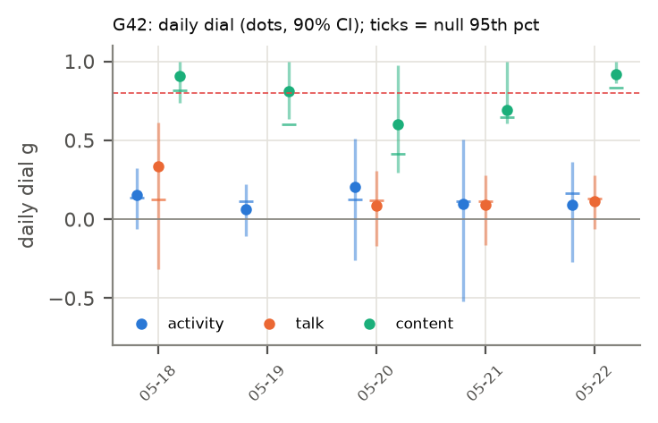

# H25 × G42: Run your own Youtube channel! (2026-05-18 → 2026-05-22)

**Verdict:** failed
**Role:** exploratory (round 1, non-holdout)
**Period:** regime III · mode I · 15 agents at start · 5 non-holdout days · 4.0 h/day (empirical).

## Why this period
One day-resolved stretch of the dial. Every non-holdout period gets the same daily dial (activity, talk, content) so periods can be compared through their fitted values. Reference values: H19 g_eq active 0.11, talk 0.08; H03 n̂ TALK 0.20.

## Prediction
*Written 2026-10-04 02:00 UTC, before running the dial on this period.* The card's predictions (P1–P7) as they apply here; H19's per-period values were known (disclosed in the card).
- **Activity dial** (stalls masked): daily values mostly in [−0.1, 0.4]; period mean near H19's g_eq active = 0.11 (± 0.02), lowered by 0–0.05 where stalls are masked: predicted range [0.03, 0.14].
- **Talk dial** (stalls kept): period mean within ± max(0.05, 2 SE) of H19's g_eq talk = 0.08.
- **Content dial** (F2): period median in [0.15, 0.6], above the activity dial (HH108; credence 0.55), and below H01's 0.74.
- **Subcritical:** every day's upper 90% bound < 0.8 in all channels.
- Regime III: activity dial expected higher than in regime I (H19's +0.11), talk dial lower.
- **Verdict rule** (card): *supported* if (i) all days subcritical in all estimable channels, (ii) the activity and talk dials with stalls kept reproduce H19's g_eq within max(0.05, 2 SE), and (iii) the period's median content dial (F2) is < 0.74; *failed* if any day has a lower 90% bound > 0.8 in any channel, or (ii) and (iii) both fail; *mixed* otherwise.
- *Against:* a confidently near-critical day; a period mean far from H19's estimator (implementation or stall effect larger than expected); content at or above 0.74 after field removal.

## Result
| Dial | days | fixed-effect mean ± SE | random-effects mean ± SE | median | between-day I² (Cochran p) | share of days with upper bound < 0.8 | max lower bound |
| --- | --- | --- | --- | --- | --- | --- | --- |
| activity (stalls masked) | 5 | 0.111 ± 0.067 | 0.111 ± 0.067 | 0.096 | 0.00 (p 0.972) | 1.00 | -0.06 |
| activity (stalls kept) | 5 | 0.112 ± 0.068 | 0.112 ± 0.068 | 0.096 | 0.00 (p 0.970) | 1.00 | -0.05 |
| talk (stalls masked) | 4 | 0.109 ± 0.068 | 0.109 ± 0.068 | 0.101 | 0.00 (p 0.914) | 1.00 | -0.06 |
| talk (stalls kept) | 4 | 0.109 ± 0.067 | 0.109 ± 0.067 | 0.101 | 0.00 (p 0.917) | 1.00 | -0.08 |
| content F1 | 5 | 0.884 ± 0.033 | 0.878 ± 0.037 | 0.873 | 0.10 (p 0.348) | 0.00 | 0.88 |
| content F2 (primary) | 5 | 0.884 ± 0.046 | 0.884 ± 0.046 | 0.812 | 0.00 (p 0.748) | 0.00 | 0.86 |
| content F3 | 5 | 0.890 ± 0.054 | 0.890 ± 0.054 | 0.832 | 0.00 (p 1.000) | 0.00 | 0.87 |

| Check | Observed | Outcome |
| --- | --- | --- |
| (i) every day subcritical (upper 90% bound < 0.8, all channels) | no | fail |
| (ii) stalls-kept dials vs H19 g_eq (active 0.11, talk 0.08) | activity 0.11, talk 0.11 | pass |
| (iii) content F2 median < 0.74 | 0.81 | fail |
| any day confidently near-critical (lower bound > 0.8) | yes | – |

Stall minutes masked: 0.0% of the day on average. T/T_c = 1/g for the activity dial (stalls masked): 9.03; amplification 1/(1 − g) = 1.12.

  
Data: `data/processed/H25-criticality-dial/G42/dial_daily.parquet`, `results.json`.

## Scorecard (period-specific axes)
- **C (adequacy):** day-level null band (circular shifts): share of days with activity dial above its null 95th percentile = 0.40.
- **D (unfitted):** H19 agreement (ii) passes; H03 n̂ TALK 0.20 vs talk dial 0.11 (cross-period test in the card).
- **G (known structure):** see the card's event tests (regime switch, goal changes) where this period is involved.

## Notes
- 2026-10-04 02:14 UTC: results filled by `analysis/write_period_folders.py --results` from `analysis/explore.py` (exploratory round 1). Prediction block above unchanged from the --predict pass.
- Reading notes (card, Results): the content dial's upper bounds are wide, so check (i) fails in every period; fixed-effect means are pulled toward days with 3–4 talkers, whose bootstrap SEs are small (compare the random-effects mean); per-pair correlation, not g, is the size-free quantity (card, post hoc PH1).
