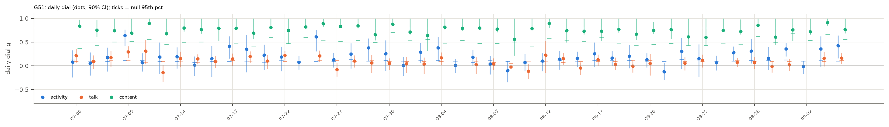

# H25 × G51: Each agent: Maximize your assigned goal! (2026-07-06 → 2026-09-04)

**Verdict:** failed
**Verdict (1b):** failed (replication, round 1: failed; corrected table, same rule) · native size-law test: failed (uninformative)
**Role:** native (round 1b: N as a control parameter; round-1 role: exploratory replication)
**Period:** regime III · mode I/K · 21 agents at start · 45 non-holdout days · 8.1 h/day (empirical).

## Why this period
One day-resolved stretch of the dial. Every non-holdout period gets the same daily dial (activity, talk, content) so periods can be compared through their fitted values. Reference values: H19 g_eq active 0.24, talk 0.11; H03 n̂ TALK 0.54.

## Prediction
*Written 2026-10-04 02:00 UTC, before running the dial on this period.* The card's predictions (P1–P7) as they apply here; H19's per-period values were known (disclosed in the card).
- **Activity dial** (stalls masked): daily values mostly in [−0.1, 0.4]; period mean near H19's g_eq active = 0.24 (± 0.01), lowered by 0–0.05 where stalls are masked: predicted range [0.16, 0.27].
- **Talk dial** (stalls kept): period mean within ± max(0.05, 2 SE) of H19's g_eq talk = 0.11.
- **Content dial** (F2): period median in [0.15, 0.6], above the activity dial (HH108; credence 0.55), and below H01's 0.74.
- **Subcritical:** every day's upper 90% bound < 0.8 in all channels.
- Regime III: activity dial expected higher than in regime I (H19's +0.11), talk dial lower.
- **Verdict rule** (card): *supported* if (i) all days subcritical in all estimable channels, (ii) the activity and talk dials with stalls kept reproduce H19's g_eq within max(0.05, 2 SE), and (iii) the period's median content dial (F2) is < 0.74; *failed* if any day has a lower 90% bound > 0.8 in any channel, or (ii) and (iii) both fail; *mixed* otherwise.
- *Against:* a confidently near-critical day; a period mean far from H19's estimator (implementation or stall effect larger than expected); content at or above 0.74 after field removal.
- The only 8-hour-day period (most minutes per day, so the tightest daily intervals); private roles; batch joins on 07-09 (NE32) and 09-03 (NE33) are exploratory events. Held-out tail (09-07 onward) excluded.

## Round 1b native test: N as a control parameter inside #51 (size law, H25-R4)
*Prediction written 2026-10-04 06:34 UTC, before computing any round-1b daily dial for #51. Seen before: the round-1 period-level PH1 result (per-pair ρ̄ flat in N for content, α ≈ 0.7 for talk across periods) and the G51 period values above; not the round-1 within-#51 day-level fits (never opened).*

**Why:** #51 is the only stretch where N changes in dated steps (21 → 32 over 11 joins) at a fixed goal, room set and hours (DQ9). Across periods, N is confounded with regime, mode and room structure; inside #51 it is not.

**Design:** daily dials on `activity_bins_fixed` (`auto` mask), day-level N (dial population) and per-pair ρ̄ = (VR − 1)/(N − 1). Two fixed-form models per channel, each with one constant fitted on the other days (leave-one-day-out): **constant ρ̄** (g = (N−1)ρ̄/(1 + (N−1)ρ̄): a shared field or size-independent per-pair coupling) and **constant g** (Curie–Weiss with J₀/N: size-free loop gain). Score = LOO squared error summed over days.
- **N1a (activity follows the size law).** For activity, constant ρ̄ beats constant g (lower LOO SSE), and Spearman(g, N) > 0 across days.
- **N1b (talk is size-free).** For talk, constant g beats constant ρ̄, and |Spearman(g, N)| < 0.3.
- Credence: N1a 0.5 (the N range is narrow and ρ̄_activity ≈ 0.01 makes the predicted rise small), N1b 0.55.
- **Verdict rule (native):** supported if N1a and N1b hold; failed if neither holds; mixed otherwise. Confound: calendar time (joins cluster in July and early September) and the 08-05 #focus room.

**Round 1b native result (run 2026-10-04 06:42 UTC, `analysis/r1b_native.py`; `data/processed/H25-criticality-dial/r1b/native/g51_days.parquet`).** 45 days; dial population N = 21–32 (activity), 15–24 (talk, content).

| Channel | Spearman(g, N) | Spearman(ρ̄, N) | median ρ̄ | LOO SSE: constant ρ̄ · constant g | winner |
| --- | --- | --- | --- | --- | --- |
| activity | +0.10 | −0.05 | 0.015 | 0.661 · 0.643 | constant g (by 3%) |
| talk | +0.28 | +0.08 | 0.011 | 0.292 · 0.304 | constant ρ̄ (by 4%) |
| content (descriptive) | +0.49 | +0.26 | 0.19 | 0.310 · 0.316 | constant ρ̄ (by 2%) |

| Prediction | Observed | Verdict |
| --- | --- | --- |
| N1a activity: constant ρ̄ wins and Spearman(g, N) > 0 | constant g wins (0.643 vs 0.661); ρ = +0.10 | ✗ |
| N1b talk: constant g wins and \|Spearman(g, N)\| < 0.3 | constant ρ̄ wins (0.292 vs 0.304); ρ = +0.28 | ✗ |

**Native verdict: failed** by the rule, but uninformative in substance: the two size readings differ by 2–4% in leave-one-day-out error. Over N = 21 → 32 at ρ̄ ≈ 0.015 the size law predicts g to rise by only about 0.09 (0.23 → 0.32), inside the day-to-day noise. #51 cannot separate them; the period-level PH1 fit (talk α = 1.25 [0.77, 1.77] on the fixed table, J₀/N) remains the evidence. Only content g clearly climbs with N inside #51 (ρ = 0.49), as a shared field predicts.

## Result
| Dial | days | fixed-effect mean ± SE | random-effects mean ± SE | median | between-day I² (Cochran p) | share of days with upper bound < 0.8 | max lower bound |
| --- | --- | --- | --- | --- | --- | --- | --- |
| activity (stalls masked) | 45 | 0.166 ± 0.019 | 0.177 ± 0.025 | 0.175 | 0.41 (p 0.002) | 1.00 | 0.42 |
| activity (stalls kept) | 45 | 0.195 ± 0.019 | 0.206 ± 0.028 | 0.191 | 0.49 (p 0.000) | 1.00 | 0.50 |
| talk (stalls masked) | 40 | 0.055 ± 0.011 | 0.090 ± 0.017 | 0.090 | 0.49 (p 0.000) | 1.00 | 0.17 |
| talk (stalls kept) | 40 | 0.053 ± 0.011 | 0.090 ± 0.018 | 0.092 | 0.48 (p 0.000) | 1.00 | 0.16 |
| content F1 | 45 | 0.818 ± 0.012 | 0.818 ± 0.012 | 0.760 | 0.00 (p 0.916) | 0.00 | 0.89 |
| content F2 (primary) | 45 | 0.818 ± 0.014 | 0.818 ± 0.014 | 0.764 | 0.00 (p 0.996) | 0.00 | 0.87 |
| content F3 | 45 | 0.822 ± 0.014 | 0.822 ± 0.014 | 0.756 | 0.00 (p 1.000) | 0.00 | 0.88 |

| Check | Observed | Outcome |
| --- | --- | --- |
| (i) every day subcritical (upper 90% bound < 0.8, all channels) | no | fail |
| (ii) stalls-kept dials vs H19 g_eq (active 0.24, talk 0.11) | activity 0.20, talk 0.05 | fail |
| (iii) content F2 median < 0.74 | 0.76 | fail |
| any day confidently near-critical (lower bound > 0.8) | yes | – |

Stall minutes masked: 2.8% of the day on average. T/T_c = 1/g for the activity dial (stalls masked): 6.03; amplification 1/(1 − g) = 1.20.

  
Data: `data/processed/H25-criticality-dial/G51/dial_daily.parquet`, `results.json`.

## Scorecard (period-specific axes)
- **C (adequacy):** day-level null band (circular shifts): share of days with activity dial above its null 95th percentile = 0.71.
- **D (unfitted):** H19 agreement (ii) fails; H03 n̂ TALK 0.54 vs talk dial 0.06 (cross-period test in the card).
- **G (known structure):** see the card's event tests (regime switch, goal changes) where this period is involved.

## Round 1b (improved data, 2026-10-04)
Same pipeline (`analysis/explore.py --data-version fixed`) on DQ8's `activity_bins_fixed` and the shared `outages_fixed` stall table (round 1's activity table dropped about half of all events). Predictions and verdict rule unchanged; check (ii) now compares with H19's estimator recomputed on the fixed table (round-1 H19 values are stale). The DQ8 row trims each day to the window in which all agents are between their first and last active minute before the block-shift null is drawn (whole-day block-shift nulls reject 28–34% of independent swarms).

| Quantity | Round 1 (old table) | Round 1b (fixed table) |
| --- | --- | --- |
| activity dial, stalls masked (fixed-effect mean; median) | 0.17; 0.17 | 0.29; 0.28 |
| activity dial, stalls kept vs H19 g_eq | 0.20 vs 0.24 | 0.31 vs 0.33 (H19 estimator on the fixed table) |
| talk dial, stalls masked (fixed-effect; random-effects) | 0.06; 0.09 | 0.16; 0.16 |
| talk dial, stalls kept vs H19 g_eq talk | 0.05 vs 0.11 | 0.16 vs 0.17 |
| days above the block-shift null q95: activity (round-1 design → **DQ8 trim**) | 32/45 | 42/45 → 12/42 |
| median activity dial with the DQ8 trim | – | 0.07 |
| content dial F2 median (inputs unchanged) | 0.76 | 0.76 |
| per-period verdict (card rule) | failed | failed |

Data: `data/processed/H25-criticality-dial/r1b/G51/`.

## Notes
- 2026-10-04 02:14 UTC: results filled by `analysis/write_period_folders.py --results` from `analysis/explore.py` (exploratory round 1). Prediction block above unchanged from the --predict pass.
- Reading notes (card, Results): the content dial's upper bounds are wide, so check (i) fails in every period; fixed-effect means are pulled toward days with 3–4 talkers, whose bootstrap SEs are small (compare the random-effects mean); per-pair correlation, not g, is the size-free quantity (card, post hoc PH1).
