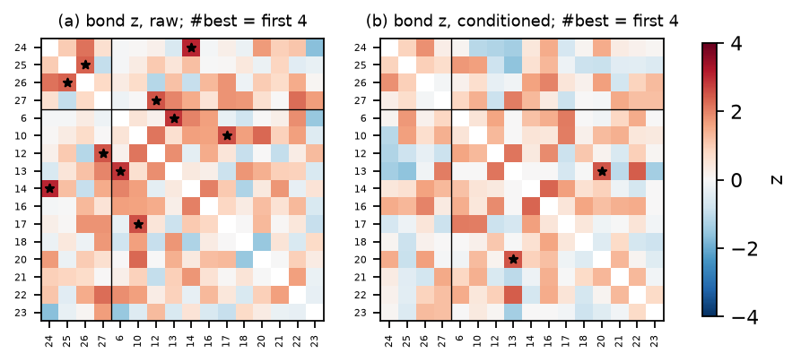

# H49 × G44: Finetune your leader! (2026-05-26 → 2026-05-29)

**Verdict:** failed
**Role:** native (exploratory; also replication)
**Period:** regime III · mode C · 4 non-holdout days × 4 h. Two rooms: `#best` (Claude Opus 4.7, Kimi K2.6, GPT-5.5, Gemini 3.5 Flash; agents 24–27) fine-tunes a leader model; `#rest` picks its own goals. Replication units 44a (16 agents) and 44b (17; Opus 4.8 and the fine-tuned leader join on 05-28). The native test merges the 4 days on the 16 agents present throughout (the leader, agent 28, is excluded). The roster join does not change that population, so the unit split is irrelevant to it (named exception).

## Why this period
H38 found #44 keeps its full collective excess after scaffold conditioning (f_scaffold −0.03). #44 is also the one regime-III period with a known small team doing a shared technical task. If regime III is a dilute ferromagnet, the strong bonds should sit inside `#best`: one coupled cluster in a paramagnetic `#rest`. The five leader checkpoints (ground truth) mark moments when the team swapped weights. They let us ask whether the team bond is ongoing coordination or a field from checkpoint events.

## Prediction
*Written 2026-10-04 05:50 UTC (card), before any coupling statistic on #44.*
- **N44a.** The six `#best` pairs have mean conditioned z ≥ 2, above every other 4-agent label set at p < 0.05 (exact enumeration over all 4-subsets), and ≥ 2 of them are significant bonds.
- **N44b.** The team forms one connected cluster of the significant graph; overall S₁ ≤ 0.3, with `#rest` mostly isolated.
- **N44c.** The six team pairs (5% of pairs) carry ≥ 30% of the conditioned excess covariance.
- **N44d.** Dropping ±30 min around the five checkpoint starts lowers the team's mean z by < 50%.
- **Replication rule** (card) on 44a and 44b, reported below.
- **Verdict rule:**
  - **supported** if N44a and N44c hold;
  - **failed** if the team pairs are not above the label-set null (p ≥ 0.2) and no significant bond touches two team members;
  - **mixed** otherwise.

## Result
<!-- KEY -->#best team pairs mean conditioned z 0.76 (label-set p 0.26), 0 significant team bonds, share of excess 10% for 5% of pairs; the whole swarm is shifted (#rest–#rest pairs 0.56; g 0.47, z 8.0); the team shows up only in talk (p 0.013)<!-- /KEY -->

16 agents present on all 4 days (the leader excluded); fixed activity bins; 200 joint block-shift surrogates.

| Prediction | Observed | Null / reference | Verdict |
| --- | --- | --- | --- |
| N44a: team pairs mean z ≥ 2, above every other 4-set at p < 0.05; ≥ 2 significant team bonds | mean z 0.76 (pairs 24–25 0.90, 24–26 1.84, 24–27 0.25, 25–26 0.95, 25–27 0.71, 26–27 −0.08); p 0.26 over all 1,820 four-sets; 0 significant team bonds | #rest–#rest pairs 0.56, cross pairs 0.32 | ✗ |
| N44b: team is one connected cluster; S₁ ≤ 0.3 | 1 significant bond in the whole graph (agents 13–20, both #rest); S₁ 0.125 | ≈ 1 false bond expected | ✗ (no cluster) |
| N44c: team carries ≥ 30% of the conditioned excess | 10.4% (5% of pairs) | uniform: 5% | ✗ |
| N44d: dropping ±30 min around checkpoints lowers team z by < 50% | 217 minutes dropped; team z 0.76 → 0.34 (−55%), p 0.62; collective excess unchanged (g 0.52, z 7.9) | – | ✗ (and moot: no team bond to begin with) |
| raw / edge variants | raw team z 1.01 (p 0.19; 1 of 5 raw significant bonds is a team pair); edge 0.77 (p 0.13) | – | descriptive |
| talk spin (secondary) | team pairs mean talk-bond z 0.91, p 0.013 over 715 four-sets; 1 significant talk bond (24–27) | #rest–#rest 0.08 | the team couples in talk |

**Reading.**
- **#44's surviving co-activation is a whole-swarm shift, not the team.** The conditioned excess is large: g 0.47, z 8.0, the strongest in regime III after 44b. But it is spread over all pairs (mean bond z 0.48; CV-C10 0.11), and the `#rest` pairs carry as much of it as the `#best` pairs.
- **The fine-tuning team is visible only in talk.** Its members talk in the same minutes (p 0.013), but they are not active in the same minutes beyond everyone else. Computer work is not where coordination shows up at 1-min resolution.
- H38's "#44 keeps its full excess" is therefore not a few strong pairs. H49's "coupled cluster in a paramagnet" fails where it had its best ground truth.

### Replication layer (units 44a, 44b)
<!-- REPLICATION_TABLE -->
| Unit | N | days | + bonds raw → edge → cond. (− cond.) | ⟨k⟩ | κ [boot 95%] | S₁ (cm) | clusters | g cond. (z) | CV-C10 | mean z (p) | skew (null q95) | verdict |
| --- | --- | --- | --- | --- | --- | --- | --- | --- | --- | --- | --- | --- |
| 44a | 16 | 2 | 4 → 2 → **1** (0) | 0.12 | 1.00 [1.00, 1.50] | 0.12 (0.12) | 2 | 0.015 (0.2) | -2.60 | 0.06 (0.30) | 0.53 (1.58) | mixed |
| 44b | 17 | 2 | 3 → 1 → **1** (0) | 0.12 | 1.00 [1.00, 2.00] | 0.12 (0.12) | 2 | 0.601 (7.3) | 0.11 | 0.49 (0.00) | -0.24 (0.62) | failed |
<!-- /REPLICATION_TABLE -->

## Scorecard (period-specific axes)
- **G (ground truth):** the known team is not a bond cluster in activity (p 0.26); it is one in talk (p 0.013).
- **C:** bond test calibrated (≈ 1 false bond per unit, synthetic size 0.05–0.06).
- **D:** CV-C10 and the team share are unfitted.

## Notes
- 2026-10-04: all numbers use `activity_bins_fixed` (DQ8 join fix) and the rebuilt scaffold reasons.
- Analysis: `analysis/native.py --only G44` (uses `G44_all` from `scheme/build_units.py`).
