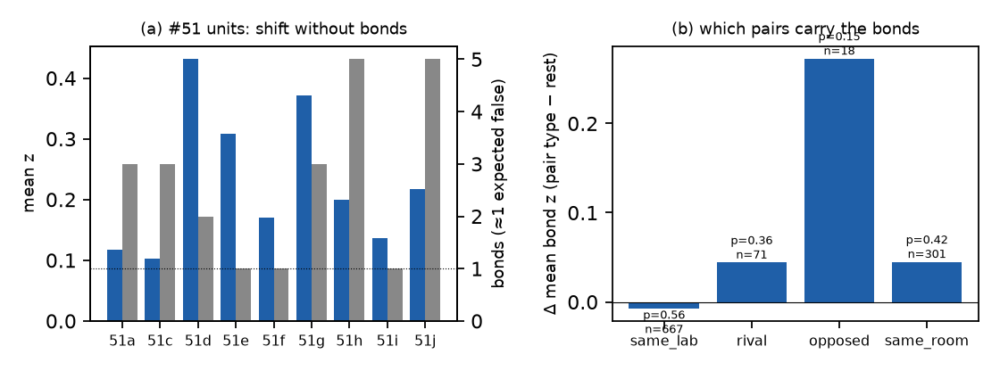

# H49 × G51: Each agent: Maximize your assigned goal! (head: 2026-07-06 → 2026-09-04)

**Verdict:** failed
**Role:** native (exploratory; also replication)
**Period:** regime III · private assigned roles · 8 h/day · 21 → 32 agents. The head (non-holdout) is split by `period_units` at roster joins and room changes. Replication units: 51a, 51c, 51d, 51e, 51f, 51g, 51h, 51i, 51j (≥ 2 days each; 51b, 51k, 51l are one-day units). The tail (09-07 →) is locked holdout.

## Why this period
H38 found the #51 head keeps nearly all of its excess co-activation after scaffold conditioning (f_scaffold 0.14, z ≈ 23). It is the largest and longest regime-III sample, with ground truth on pairs:
- 7 rival pairs (two agents holding the same role);
- 2 opposed pairs (prankster vs psychologist / ethicist);
- labs (many same-lab pairs);
- the #general / #focus split in 08-05 → 08-21 (unit 51g).

If the strong bonds live anywhere, they live here. The labels can tell agent coupling (rival or same-room pairs) from the provider-field rival R2 (same-lab pairs stalling together when their API is slow).

## Prediction
*Written 2026-10-04 05:50 UTC (card), before any coupling statistic on #51.*
- **N51a (bonds are pair properties).** Across adjacent #51 units, the median correlation of conditioned bond z over common pairs is ≥ 0.3, and a significant bond has z > 1 in the next unit ≥ 60% of the time.
- **N51b (coupling vs provider field).** H49's coupling reading: significant bonds enriched on rival and same-room pairs. R2: same-lab enrichment (Mantel–Haenszel OR > 2) that role and room don't explain. Stated expectation: R2 wins.
- **N51c.** Every #51 unit is below percolation (κ < 2) despite N = 21–28.
- **Replication rule** (card) on each unit, reported below.
- **Verdict rule:**
  - **supported** if N51a and N51c hold and some significant bonds are not same-lab (bonds are stable pair properties in a sub-percolating graph, not only a provider field);
  - **failed** if N51a fails (bonds don't recur) or N51c fails;
  - **mixed** otherwise.

## Result
<!-- KEY -->9 units: 24 significant + bonds / 3,023 pairs (≈ 9 false expected), κ ≤ 1.6 everywhere; conditioned excess z 2.7–10 in 7 units but CV-C10 0.08–0.22 (dense); bonds don't recur (adjacent-unit r median 0.02); no same-lab, rival or opposed enrichment<!-- /KEY -->

Replication units 51a, 51c–51j (fixed activity bins, rebuilt scaffold reasons, 200 surrogates each).

| Prediction | Observed | Null / reference | Verdict |
| --- | --- | --- | --- |
| N51a: adjacent-unit correlation of bond z ≥ 0.3; a significant bond recurs (z > 1 next unit) ≥ 60% | median r 0.02 (range −0.08 to 0.09 over 8 adjacent pairs, 210–378 common pairs each); recurrence 5/19 = 26% | pure noise: r ≈ 0; recurrence ≈ 16% | ✗ |
| N51b: bonds enriched on rival / same-room pairs (coupling) vs same-lab pairs (R2, OR > 2; stated expectation) | same lab: 3 of 24 significant bonds on 667 same-lab pairs, MH OR 0.50, Δz −0.01 (p 0.56); rival: 0 of 71 pairs, Δz +0.04 (p 0.36); opposed: 0 of 18, Δz +0.27 (p 0.15); same room (51g): uninformative (only 2 of 27 agents mostly in #focus) | within-unit permutation of the pair label | ✗ for both readings (R2 rejected; no coupling enrichment) |
| N51c: every unit below percolation (κ < 2) | κ 1.0–1.6; S₁ ≤ 0.15; clusters of 2–4 | – | ✓ (power-limited) |
| replication rule (P2): significant excess ⇒ CV-C10 ≥ 0.4 | excess z > 2 in 51d, e, f, g, h, i, j; CV-C10 0.08–0.22 | synthetic dense 0.13, dilute 0.3–0.7 | ✗ (dense) |

**Reading.**
- **The #51 head's "full excess" (H38) is a uniform shift.** Mean bond z is +0.14 to +0.43 in the units with a significant excess. The few significant bonds are about as many as the false-positive count (24 vs ≈ 9 expected over 9 units; 2.6×). They are not the same pairs from one unit to the next, and they don't sit on rivals (same role), opposed pairs, or same-lab pairs.
- **The provider-field rival (R2) is rejected.** Same-lab pairs are not more coupled than others (also across all regime-III units: OR 0.62, Δz +0.02, p 0.34). Whatever the residual is, it isn't labs stalling together.
- **Verdict failed** (N51a): there are no stable strong bonds in #51.

### Replication layer (units 51a–51j)
<!-- REPLICATION_TABLE -->
| Unit | N | days | + bonds raw → edge → cond. (− cond.) | ⟨k⟩ | κ [boot 95%] | S₁ (cm) | clusters | g cond. (z) | CV-C10 | mean z (p) | skew (null q95) | verdict |
| --- | --- | --- | --- | --- | --- | --- | --- | --- | --- | --- | --- | --- |
| 51a | 21 | 3 | 3 → 1 → **3** (0) | 0.29 | 1.00 [1.00, 1.75] | 0.10 (0.10) | 2,2,2 | 0.034 (0.9) | -0.65 | 0.12 (0.01) | 2.22 (1.76) | mixed |
| 51c | 25 | 5 | 6 → 3 → **3** (2) | 0.24 | 1.00 [1.00, 2.88] | 0.08 (0.08) | 2,2,2 | 0.061 (1.9) | 0.28 | 0.10 (0.04) | 0.28 (0.50) | mixed |
| 51d | 26 | 5 | 4 → 2 → **2** (0) | 0.15 | 1.00 [1.00, 4.04] | 0.08 (0.08) | 2,2 | 0.334 (10.0) | 0.12 | 0.43 (0.00) | -0.05 (0.23) | failed |
| 51e | 27 | 3 | 2 → 2 → **1** (0) | 0.07 | 1.00 [1.17, 2.95] | 0.07 (0.07) | 2 | 0.422 (9.6) | 0.08 | 0.31 (0.00) | 0.10 (0.27) | failed |
| 51f | 27 | 5 | 5 → 3 → **1** (1) | 0.07 | 1.00 [1.00, 3.25] | 0.07 (0.07) | 2 | 0.095 (3.2) | 0.09 | 0.17 (0.00) | -0.03 (0.24) | failed |
| 51g | 27 | 13 | 8 → 2 → **3** (0) | 0.22 | 1.33 [1.33, 3.44] | 0.11 (0.10) | 3,2 | 0.155 (8.4) | 0.10 | 0.37 (0.00) | -0.13 (0.24) | failed |
| 51h | 27 | 4 | 3 → 3 → **5** (0) | 0.37 | 1.60 [1.14, 3.30] | 0.15 (0.12) | 4,2,2 | 0.148 (4.1) | 0.22 | 0.20 (0.00) | 0.62 (0.41) | mixed |
| 51i | 28 | 2 | 4 → 1 → **1** (1) | 0.07 | 1.00 [1.00, 2.96] | 0.07 (0.07) | 2 | 0.137 (2.7) | 0.10 | 0.14 (0.01) | 0.12 (0.29) | failed |
| 51j | 29 | 2 | 3 → 3 → **5** (0) | 0.34 | 1.00 [1.00, 3.29] | 0.07 (0.07) | 2,2,2,2,2 | 0.229 (4.4) | 0.15 | 0.22 (0.00) | 0.13 (0.26) | failed |
<!-- /REPLICATION_TABLE -->

## Scorecard (period-specific axes)
- **G (ground truth):** rival, opposed and same-lab labels carry no bond enrichment.
- **H (rivals):** R2 (provider field) rejected; R1 (dense / shared field) favored by CV-C10 and by the absent pair reliability.
- **I (transfer):** bonds don't transfer between adjacent units of the same period.

## Notes
- 2026-10-04: all numbers use `activity_bins_fixed` (DQ8 join fix) and the rebuilt scaffold reasons.
- Analysis: `analysis/native.py --only G51`; room majority for 51g from `ground_truth_labels` `room_presence` (preferred rows).
