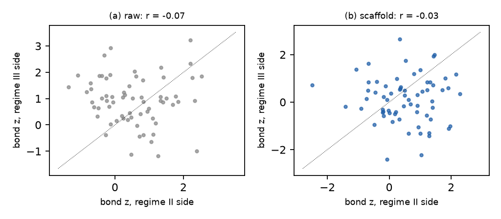

# H49 × NE14: the regime boundary (regime II → III, 2026-03-24)

**Verdict:** mixed
**Role:** native (exploratory; boundary test, transition exception c)
**Period:**
- **II side:** #35 + #36a (6 days, 4 h/day).
- **III side:** #36b + #36c + #37 (7 days, as in H38's NE14).
- One fixed population: the 12 agents present on every day of both sides.
- The III side includes #37 (a free week; a goal change is bundled) and the 513-min gap day (off-schedule minutes are dropped by the conditioning).

## Why this period
NE14 switched the scaffold from discrete sessions to perma-computer-use with consolidation. H38 showed the raw co-activation jump at this boundary (+0.15) is scaffold: it vanishes under conditioning. If H49's bonds are properties of agent pairs rather than of the scaffold, the conditioned bonds should survive the change while the raw bonds jump.

## Prediction
*Written 2026-10-04 05:50 UTC (card), before any coupling statistic on these days.*
- **N14a.** Raw significant positive bonds rise from II to III; conditioned bonds rise by at most half as much.
- **N14b.** Conditioned bonds persist: the disattenuated cross-boundary correlation of z is ≥ 0.5 (split-half reliabilities from even / odd 30-min blocks; QAP p), and ≥ 50% of significant bonds on either side have z > 1 with the same sign on the other side.
- **Verdict rule:**
  - **supported** if N14a and N14b hold;
  - **failed** if N14b fails with adequate reliability (both split-half reliabilities ≥ 0.3);
  - **mixed** otherwise (including too few bonds or too little reliability to tell).

## Result
<!-- KEY -->raw excess gain rises II → III (0.20 → 0.32) but raw significant bonds don't (6 → 4); conditioned excess falls (0.19 → 0.05); bond z has no split-half reliability on either side (r −0.05, −0.10) and no cross-boundary correlation (r −0.03)<!-- /KEY -->

12 agents present on all 13 days; fixed activity bins; 200 surrogates per side.

| Prediction | Observed | Null / reference | Verdict |
| --- | --- | --- | --- |
| N14a: raw significant bonds rise II → III; conditioned rise ≤ half of that | raw 6 → 4, edge 4 → 0, conditioned 2 → 1 (66 pairs; ≈ 1 false per side). Raw excess gain 0.196 → 0.316 (H38's jump); conditioned 0.188 → 0.050 | – | ✗ for the bond count (the raw *gain* jumps, the raw *bonds* don't) |
| N14b: disattenuated cross-boundary bond-z correlation ≥ 0.5; ≥ 50% of significant bonds persist | split-half reliability r −0.05 (II), −0.10 (III); cross r −0.03 (QAP p 0.61); 1 of 6 significant bonds persists | QAP | not evaluable (reliability ≈ 0) |
| context | mean bond z: II 0.51 (raw 0.54), III 0.12 (raw 0.92) | – | dense shift on the II side; scaffold shift on the III side |

**Reading.**
- **The raw jump at the boundary is a uniform shift, not new bonds.** Raw mean bond z rises from 0.54 to 0.92 while the count of significant raw bonds does not rise. Day-edge co-activation raises every pair a little (H38's +0.15 jump), and conditioning removes it (III-side mean z 0.12).
- **The II side has its own dense residual** (conditioned g 0.19, mean z 0.51), which is gone on the III side (0.05). Read with care: the III side includes #37 (a free week) and the 513-min gap day.
- **There are no persistent bonds to follow across the boundary.** Neither side has reliable pair structure.
- **Verdict mixed:** N14a fails on bonds, and N14b is not evaluable.

## Scorecard (period-specific axes)
- **E (interventional):** the scaffold change moves the uniform shift (raw), not pair structure.

## Notes
- 2026-10-04: all numbers use `activity_bins_fixed` (DQ8 join fix) and the rebuilt scaffold reasons.
- Windows: `NE14_II`, `NE14_III` in `scheme/build_units.py`. Analysis: `analysis/native.py --only NE14`.
