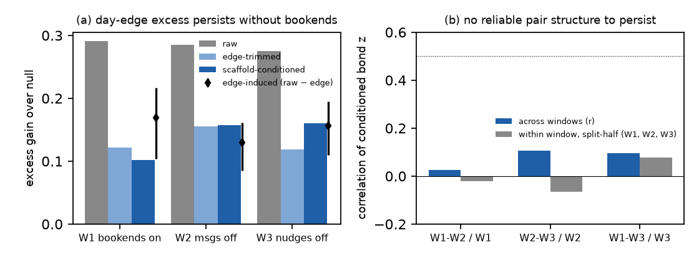

# H49 × NE43: the automated speaker goes quiet inside #51 (bookend messages off after 08-04, nudges off after 08-20)

**Verdict:** mixed
**Role:** native (exploratory)
**Period:** inside #51 (regime III, private roles, 8 h/day). Three day-windows with one fixed population (27 agents present on every day of all three):
- **W1** 07-27 → 08-04 (7 days): daily pause/resume bookend messages and nudges;
- **W2** 08-05 → 08-20 (12 days): bookend messages gone, nudges continue (08-05 also starts the #general / #focus room split);
- **W3** 08-21 → 09-04 (11 days): no automated messages at all (single #general room from 08-24).

## Why this period
The brief framed NE43 as "the daily bookends disappear", a natural test of H38's day-edge adjustment: if the drive goes, raw co-activation should fall to the adjusted level while the conditioned bonds stay the same. Before any statistic was computed, the data showed two things:
- The bookend messages stop 16 days earlier than the catalog says (after 08-04).
- The village window itself (≈ 16:01 → 00:05 UTC) is unchanged after both dates.

So the operator still starts and stops every agent; only the announcement disappears. That turns NE43 into a sharper test: is H38's day-edge drive the *schedule* (agents booted and stopped together) or the *message* (agents reacting to the announcement)? Either way, if H38's adjustment is right, the conditioned bonds should not care.

## Prediction
*Written 2026-10-04 05:50 UTC (card), before any coupling statistic on #51. Seen: bookend and nudge dates, window start/end times, nudge target counts (186 two-target and 27 three- or four-target nudges in #51).*
- **N43a (schedule, not message).** The edge-induced excess E_raw − E_edge in W2 and in W3 is ≥ 0.5 × its W1 value (day bootstrap CI reported). If it falls below 0.3 × W1, the drive was the message, and H38's edge mask was conditioning on a reaction to the announcement.
- **N43b (bonds unchanged).** The disattenuated W1 ↔ W3 correlation of conditioned bond z is ≥ 0.5, using split-half (even / odd 30-min blocks) reliabilities and a QAP p-value. Per-pair significant rates are within a factor of 2 across windows.
- **N43c (co-kicks).** Pairs named together in a nudge (W1–W2) have higher conditioned bond z than other pairs while the nudger runs (Δz ≥ 0.3, within-window permutation p < 0.05), and the gap at least halves in W3. If co-named pairs carry the strong bonds and lose them when nudges stop, part of the "coupling" is a common kick.
- **Verdict rule:**
  - **supported** if N43a and N43b hold (H38's adjustment isolates a schedule drive and leaves bonds invariant);
  - **failed** if N43b fails (bonds change with the scaffold);
  - **mixed** otherwise.
  - N43c is reported, not part of the verdict.

## Result
<!-- KEY -->edge-induced excess W1 0.169 → W2 0.130 (×0.77 [0.49, 1.40]) → W3 0.157 (×0.93): the drive is the schedule, not the message; split-half bond reliability ≈ 0 in every window (no pair structure to persist); co-nudged pairs Δz +0.58 (p 0.0005) while nudges run, +0.20 after<!-- /KEY -->

Fixed population of 27 agents; fixed activity bins (`activity_bins_fixed`) and the rebuilt scaffold reasons (`outages_fixed`). Excess gains are over 200 joint block-shift surrogates; CIs are day bootstraps (500) with the null means held fixed.

| Prediction | Observed | Null / reference | Verdict |
| --- | --- | --- | --- |
| N43a: edge-induced excess E_raw − E_edge in W2, W3 ≥ 0.5 × W1 | W1 0.169 [0.104, 0.217]; W2 0.130 [0.086, 0.161], ratio 0.77 [0.49, 1.40]; W3 0.157 [0.110, 0.195], ratio 0.93 [0.59, 1.52] | message-drive reading: < 0.3 × W1 | ✓ |
| N43b: disattenuated W1 ↔ W3 bond-z correlation ≥ 0.5 | across windows r = 0.03 (W1–W2, QAP p 0.33), 0.11 (W2–W3, p 0.03), 0.10 (W1–W3, p 0.04); within-window split-half r = −0.02, −0.06, +0.08, so the reliabilities are ≤ 0.14 and disattenuation is undefined | QAP label permutation | not evaluable: no reliable pair structure |
| N43b: per-pair significant rates within ×2 | 2, 1, 4 significant positive bonds of 351 (≈ 1 false expected per window) | – | at the false floor |
| N43c: co-nudged pairs Δz ≥ 0.3 while nudges run, halves after | 42 co-named pairs: W1 +0.13 (p 0.23), W2 +0.58 (p 0.0005), W3 +0.20 (p 0.13); 0–1 of them significant | within-window permutation | partial (W2 yes, W1 no) |
| context: conditioned excess gain | W1 0.102 (z 3.7), W2 0.157 (z 7.3), W3 0.161 (z 6.9); mean bond z 0.21, 0.36, 0.39; CV-C10 0.20, 0.11, 0.15 | – | dense shift in every window |

**Reading.**
- **H38's day-edge drive is the operator's schedule, not the announcement.** The edge-induced excess barely moves when the bookend messages vanish (08-05), or when the nudges also vanish (08-21). Agents still boot and stop together at 16:00 and 00:00 UTC. So H38's edge mask conditions on the scaffold's start/stop, which is what it should do.
- **The conditioned bonds can't "stay the same", because there is no pair structure to stay.** In every window the bond z-vector is noise between halves of the same window (split-half r ≈ 0), while the mean z is clearly positive (0.21–0.39). That is the dense-shift signature: every pair carries a little, no pair carries a lot.
- **Co-kicks.** Pairs named together in a nudge co-activate more while nudges run (W2), and less once they stop. That is a common-kick contribution to the residual, small at the scale of the whole excess.
- **Verdict mixed:** N43a holds; N43b cannot be evaluated because the bonds have no reliable structure.

Data: `data/processed/H49-dilute-ferromagnet/native/NE43.json`; windows in `NE43/NE43_W*.json`.

## Scorecard (period-specific axes)
- **E (interventional):** the schedule-vs-message contrast is a real natural experiment. It confirms that the edge drive survives the removal of the announcement, which supports H38's mask, but tests nothing about H49's bonds.
- **G (ground truth):** nudge targets (co-kicks) are known: they partly explain W2's pair structure.

## Notes
- 2026-10-04: first run on the original `activity_bins` was superseded before the native tests ran (DQ8 join bug, see card); all numbers above use the fixed bins.
- Windows and population: `scheme/build_units.py` (`NE43_W1/W2/W3`). Analysis: `analysis/native.py --only NE43`.
